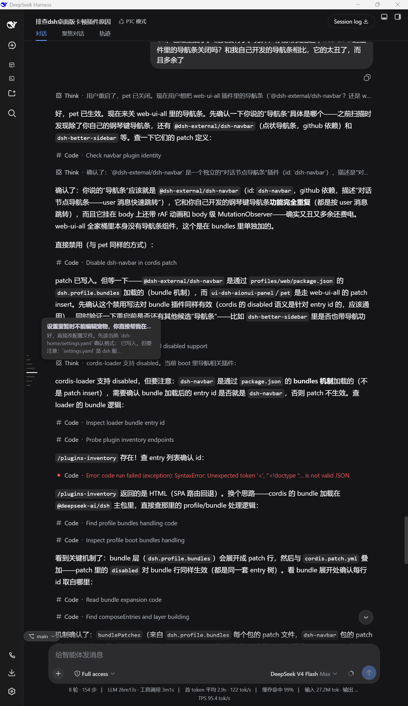
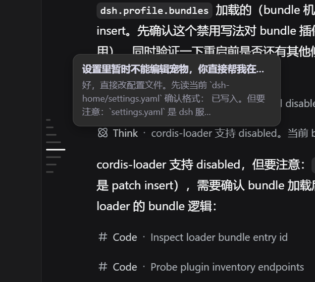
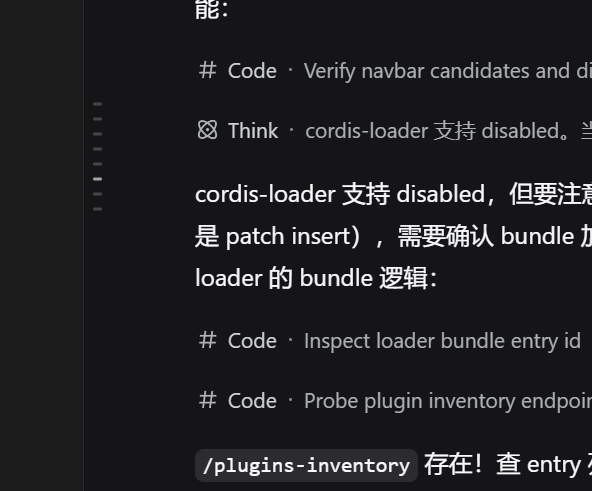
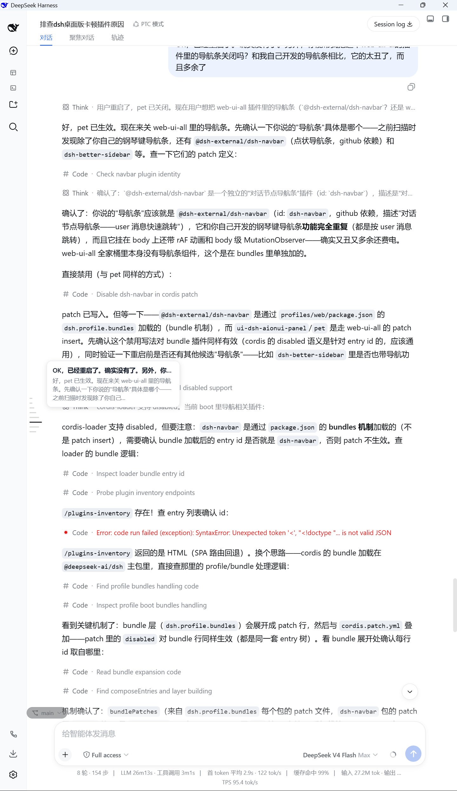
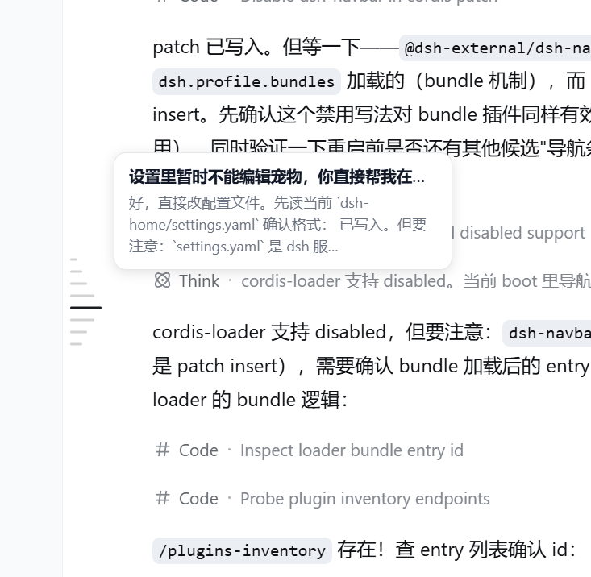
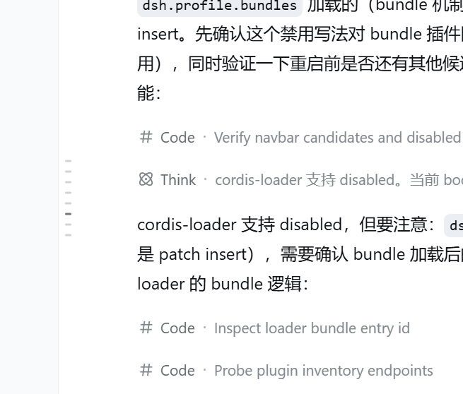

# dsh-navigation-bar

A piano-key **in-conversation** navigation bar for the DeepSeek Harness Web GUI:
one key anchors one user message of the current session, hovering shows a
"user message + model reply" preview, and clicking smooth-scrolls to that
message. Built on the official DSH dual-face plugin mechanism (host + browser
half) — no DSH source changes.

[中文](README.md)

## Screenshots

**Dark theme · hovered** (full view + focused detail):



| Dark hover focus | Dark idle focus |
| --- | --- |
|  |  |

**Light theme** (hovered / idle full views):



| Light hover focus | Light idle focus |
| --- | --- |
|  |  |

> Full views show the bar in its real position within a session; focused views
> show the piano-key details (key shapes, hover ladder, message preview tooltip).

## Features

- **In-conversation navigation**: one key per user message (including
  steering messages sent while an agent is running), in chronological order;
  model replies share their turn's key and appear in the preview.
- **Reference-accurate visuals**: fixed 10px key pitch, 2px bars, 6px resting /
  26px hovered length (≈4.3×), cluster **vertically centered** in the message
  area; colors measured pixel-by-pixel from the reference images (light
  `#D2D3D3` / `#767779` / `#1A1C1F`, dark `#454545` /
  `#A3A3A3` / `#FFFFFF`).
- **Hover ladder**: the hovered key lengthens and recolors, the 3 adjacent keys
  step down (20 / 14 / 10px, ≈77% / 54% / 38%), the 4th neighbor returns to
  resting length, and edge keys clip naturally on one side.
- **Hover tooltip**: user message on one line (ellipsis) + the matching model
  reply in at most 3 lines (width-model JS truncation + `-webkit-line-clamp`
  fallback; overflow ends with …).
- **Active highlight**: while idle, the key of the message currently in view
  changes color only (length unchanged), following the scroll in real time.
- **Click to jump**; automatic light/dark theming (`data-ds-dark-theme` +
  prefers-color-scheme fallback).

## Install

[](https://www.npmjs.com/package/@kelearns/dsh-navigation-bar)
[](https://www.npmjs.com/package/@kelearns/dsh-navigation-bar)
[](LICENSE)

Installed into the web profile through the official DSH plugin mechanism:

```bash
# From npm (released)
dsh plugin --profile web add @kelearns/dsh-navigation-bar

# Or local development (link mode; edits to lib/client.js apply on page refresh)
dsh plugin --profile web add link:<this-directory>
```

> Published on npm: [npmjs.com/package/@kelearns/dsh-navigation-bar](https://www.npmjs.com/package/@kelearns/dsh-navigation-bar)
>
> Listed in [awesome-dsh-plugin](https://github.com/awesome-dsh-plugin/awesome-dsh-plugin) curated registry;
> also searchable as `navigation-bar` in the **Plugin Market** tab of dsh settings ([dsh-market](https://github.com/dsh-market/dsh-market)).

Note: the plugin roster is loaded at instance startup — after adding a new
plugin, restart the `dsh web` instance, then refresh the page.

## Layout

| File | Purpose |
| --- | --- |
| `index.js` | host half (no-op cordis plugin) |
| `lib/client.js` | browser half (hand-written bundle, no build step; `window.__ModuleLoader__.load`) |
| `cordis.patch.yml` | bundle patch: inserts the plugin row into the web profile roster |
| `package.json` | `dsh.bundle.patch` + `dsh.client` (platform web) declarations |
| `test/` | headless-browser CDP diagnostics + standalone offline test page |

Data sources (all official APIs):
- `ctx.sessions.binding(currentId).session` → `ConversationSnapshot`
  (subscribed live via `useSyncExternalStore`)
- DOM anchors: scrollport `[data-conversation-scroll]`, message rows
  `[data-chat-anchor-key]`

## Development / Testing

```bash
# Headless Edge + CDP audit: open a real session, check layout / colors / tooltip
node test/cdp-audit.mjs

# Reference-image pixel measurement (key pitch / ladder / palette)
node test/img-analysis.cjs   # idle reference images
node test/img-strip.cjs      # hover reference images (ladder lengths & colors)
```

## License

MIT
